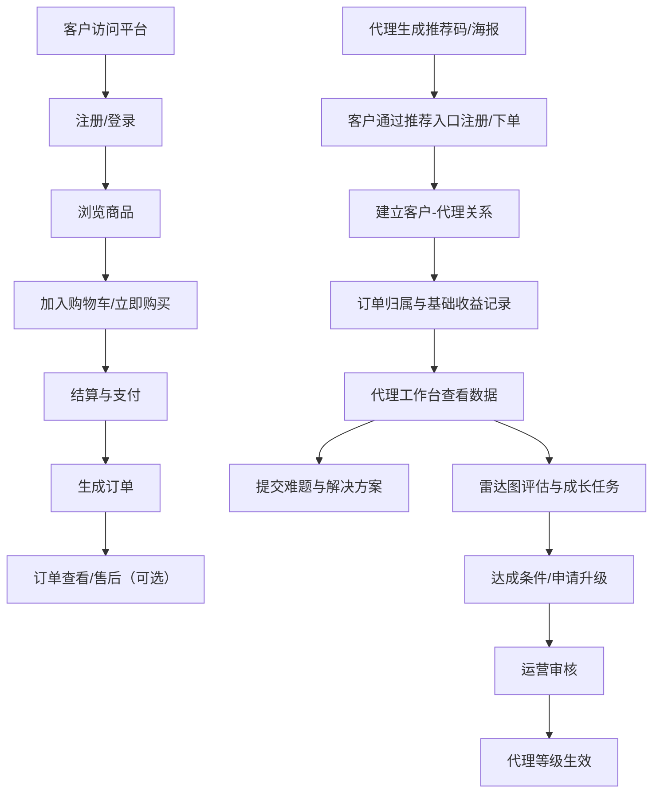

## 1. 产品概述
御承美洗护产品在线销售平台（网站 + 移动端），围绕“品牌建设 + 商品销售 + 订单履约 + 代理体系”构建清晰、克制、可持续的线上经营能力。
- 解决问题：线上成交路径不清晰、价格体系与代理制度难落地、客户身份与折扣理解成本高、代理管理缺少工具与标准
- 目标用户：终端消费者（普通/VIP）、代理团队（2级/1级/总代）、平台运营/仓配/客服人员
- 商业价值：提升成交转化与客单、形成可追溯的推荐关系、降低运营成本、提升代理组织稳定性与执行一致性

## 2. 核心功能

### 2.1 用户角色
| 角色 | 注册/开通方式 | 核心权限 |
|------|--------------|----------|
| 游客 | 无需注册 | 浏览品牌与产品信息、查看公开内容 |
| 普通客户 | 手机号验证码注册 | 下单购买、查看订单、管理收货地址 |
| VIP客户 | 满足条件后由系统或运营升级 | 享受VIP价格与专属权益入口 |
| 二级代理 | 通过邀请码/上级邀请开通 | 客户推荐绑定、查看基础收益概览、生成分享素材、学习中心、雷达图自评/成长任务 |
| 一级代理 | 由运营审核或达到条件升级 | 管理二级代理、查看团队概览、团队协同素材库、价格与权限提升 |
| 总代 | 由品牌方授权开通 | 管理全域团队与区域策略、查看全域经营数据、制度配置参与（受控） |
| 平台管理员 | 后台创建 | 商品/库存/价格体系、订单/发货、用户与关系、代理等级与规则、内容与运营配置 |
| 仓配/客服 | 后台创建 | 发货/物流录入、售后处理、客户信息查看（受限）、订单备注与沟通记录 |

### 2.2 功能模块（页面级）
1. **品牌与商城首页**：以销售为主的产品陈列与品牌表达、爆款/组合推荐、登录入口与身份展示
2. **商品详情**：规格/价格（按角色）、使用建议与成分故事（避免敏感功效词）、评价与问答、加入购物车/立即购买
3. **购物车/结算**：优惠与权益、收货地址、支付确认、开票信息（可选）
4. **订单**：订单状态、订单详情、售后入口（可选）
5. **个人中心**：资料管理、地址管理、订单列表、权益中心（VIP）、隐私与安全
6. **代理工作台（移动端优先）**：客户推荐与绑定、客户跟进、基础收益概览、雷达图与成长、案例/难题与解决方案分享、素材中心
7. **管理后台（PC）**：用户与代理、关系链、价格体系、订单管理、内容与物料、运营配置、数据看板

### 2.3 页面细节（关键模块）
| 页面名称 | 模块名称 | 功能描述 |
|---------|----------|----------|
| 品牌与商城首页 | 产品矩阵 | 按系列/场景筛选；支持“适合人群/头皮感受”等非敏感标签 |
| 品牌与商城首页 | 登录入口与身份 | 顶部登录图标；自动展示当前身份（游客/客户/VIP/代理/管理员） |
| 品牌与商城首页 | 新客绑定提醒 | 新客户提示填写代理推荐码以获得对应折扣与价格权益 |
| 商品详情 | 分层价格展示 | 根据用户角色展示对应价格与权益说明；未登录提示“登录后查看专属权益” |
| 商品详情 | 内容合规文案 | 强调植物草本原生、香气与肤感体验、使用方法与注意事项；避免敏感功效词 |
| 购物车/结算 | 价格校验 | 结算时再次按角色校验价格，防止前端篡改；保存价格快照到订单 |
| 订单 | 状态与详情 | 展示订单号、金额、商品明细、收货信息与状态（不展示物流轨迹） |
| 个人中心 | 资料与隐私 | 头像/昵称/手机号绑定；敏感字段脱敏展示；支持注销/导出申请（可选） |
| 代理工作台 | 推荐与绑定 | 生成推荐码/链接/海报；客户注册/下单后自动建立关系链（可配置：注册绑定/首单绑定） |
| 代理工作台 | 客户管理 | 客户列表、标签（新客/活跃/沉默）、最近下单时间、复购提醒、沟通记录（简版） |
| 代理工作台 | 基础收益概览 | 作为“关系基础收入”展示：订单归属、结算周期、预计/已结算；不突出“主要收入”叙事 |
| 代理工作台 | 雷达图评估 | 4-5维度能力评估（如：获客、转化、复购、内容分享、团队协作）；维度可配置；支持周/月自评与运营评语 |
| 代理工作台 | 难题与解决方案库 | 代理提交“遇到的难处/解决方案/话术截图”；可被点赞、收藏、置顶；形成组织资产 |
| 代理工作台 | 素材中心 | 海报/短文案/活动图；一键保存与分享；按活动与主题分类 |
| 管理后台 | 价格体系 | 普通/VIP/二级/一级/总代多级价格表；支持按SKU、按时间段生效；审计记录 |
| 管理后台 | 订单与发货 | 订单检索、批量发货、导出、售后处理、发货异常标记 |
| 管理后台 | 关系链与归属 | 客户与代理绑定关系查询、变更申请与审核、异常检测（刷单/多设备） |

## 3. 核心流程

### 3.1 关键业务流（文字）
- **客户购买**：注册/登录 → 浏览商品 → 加购/结算 → 支付 → 生成订单 → 订单列表/详情查看 → 售后（可选）
- **VIP升级**：满足规则（可配置）→ 系统自动升级或运营审核升级 → 生效后展示VIP价格与权益
- **推荐关系形成**：代理生成推荐码/链接/海报 → 客户通过链接注册或首单购买 → 系统记录归属关系与有效期规则（可配置）→ 订单归属产生基础收益与经营数据
- **代理分级与成长**：代理完成任务/达成指标（可配置）→ 申请升级 → 运营审核 → 生效后获得更高等级权限与价格

### 3.2 流程图（Mermaid）

## 4. 用户界面设计

### 4.1 设计风格
- 视觉方向：植物草本原生的高级感与克制的“东方自然”调性，强调质感、留白与细节纹理
- 色彩建议：深玉绿色（主色）+ 暖沙金/米白（辅助）+ 深棕灰（文本）+ 少量朱砂红/铜金（强调）
- 按钮风格：圆角矩形、细描边与微弱内阴影；主按钮深色实心，次按钮描边透明底
- 字体建议：标题使用更具气质的衬线/宋体风格中文字体方案，正文使用清晰的无衬线中文字体方案
- 布局：桌面端偏“编辑部式”网格，移动端以卡片与步骤式结算为主；关键CTA固定底栏

### 4.2 页面设计概览
| 页面名称 | 模块名称 | UI元素 |
|---------|----------|--------|
| 品牌与商城首页 | 首屏主张 | 大字号标题、草本纹理背景、渐隐动效、产品矩阵入口卡片 |
| 商品详情 | 分层价格与权益 | 角色标签徽章、价格层级提示、权益说明弹层、规格选择器 |
| 代理工作台 | 雷达图与成长 | 雷达图动效、维度说明抽屉、周/月评估入口、成长任务清单 |
| 管理后台 | 价格体系与订单 | 密度更高的数据表格、筛选器、批量操作、审计记录时间线 |

### 4.3 响应式与移动端
- 桌面优先：管理后台与数据看板以桌面端为主
- 移动优先：客户购买与代理工作台以移动端为主，支持PWA（添加到桌面、离线缓存基础页面）
- 触控优化：大尺寸点击区域、底部固定结算栏、弹层/抽屉交互统一
