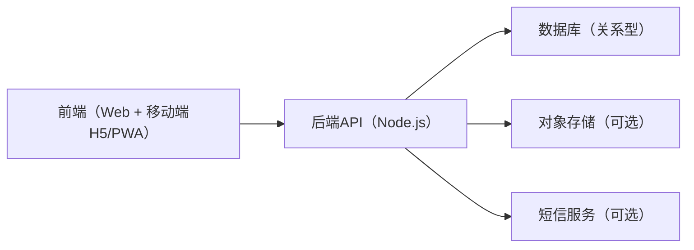
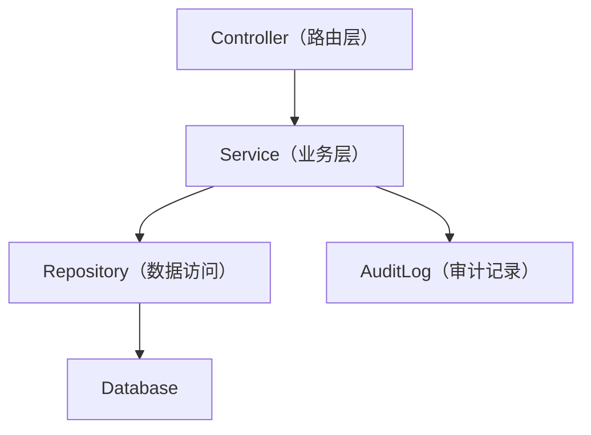
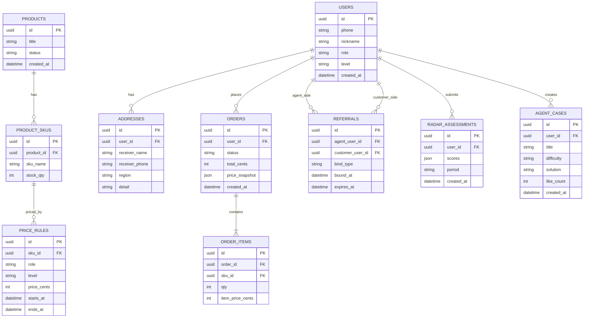

## 1. 架构设计


## 2. 技术说明
- 前端：React@18 + TypeScript + vite + tailwindcss@3
- 路由：react-router
- 状态与请求：基于 fetch 封装（或后续选型轻量请求库）
- 图表：基于 SVG/Canvas 的雷达图组件（前端自绘，减少依赖）
- 后端：Node.js + Express@4（REST API）
- 鉴权：JWT（access token）+ httpOnly cookie（可选，按部署形态）
- 数据库：PostgreSQL（生产建议）；开发/演示可用 SQLite
- 文件/物料：本地存储（演示）→ 对象存储（生产可选，用于海报/素材/头像）
- 部署：前后端分离；静态资源CDN（可选）

## 3. 路由定义（前端）
| 路由 | 用途 |
|------|------|
| / | 品牌与商城首页 |
| /products | 商品列表/筛选 |
| /products/:id | 商品详情（含分层价格） |
| /cart | 购物车 |
| /checkout | 结算与支付确认 |
| /orders | 订单列表 |
| /orders/:id | 订单详情（不展示物流轨迹） |
| /me | 个人中心 |
| /agent | 代理工作台首页 |
| /agent/customers | 客户管理 |
| /agent/growth | 雷达图评估与成长任务 |
| /agent/library | 难题与解决方案库、素材中心 |
| /admin | 管理后台入口（权限控制） |

## 4. API 定义（后端）

### 4.1 认证与用户
- POST /api/auth/request-code：请求短信验证码（可选）
- POST /api/auth/login：手机号验证码登录
- POST /api/auth/logout：退出
- GET /api/users/me：获取当前用户信息与角色
- PATCH /api/users/me：更新个人资料
- GET /api/addresses：收货地址列表
- POST /api/addresses：新增地址
- PATCH /api/addresses/:id：更新地址
- DELETE /api/addresses/:id：删除地址

### 4.2 商品与价格
- GET /api/products：商品列表
- GET /api/products/:id：商品详情（基础信息）
- GET /api/pricing/quote?skuId=：按当前用户角色返回可购买价格（服务端计算）
- GET /api/price-tiers：价格层级定义（后台/前台展示用）

### 4.3 订单与发货
- POST /api/orders：创建订单（服务端落单并保存价格快照）
- GET /api/orders：订单列表
- GET /api/orders/:id：订单详情（含物流）
- POST /api/orders/:id/cancel：取消订单（规则控制）
- POST /api/orders/:id/confirm：确认收货
- POST /api/admin/shipments：创建发货记录（后台）
- PATCH /api/admin/shipments/:id：更新物流单号/状态（后台）

### 4.4 推荐关系与代理体系
- POST /api/referrals/bind：建立客户-代理关系（注册绑定/首单绑定规则由配置控制）
- GET /api/referrals/me：获取当前客户的归属关系（用于新客绑定提醒与折扣说明）
- GET /api/agent/overview：代理工作台概览（客户数、近30天订单等）
- GET /api/agent/customers：代理客户列表（带标签/状态）
- GET /api/agent/team：下级代理团队概览（一级/总代）
- GET /api/agent/income：基础收益概览（订单归属、结算状态）
- GET /api/agent/radar/template：雷达维度模板（可配置）
- POST /api/agent/radar/assessments：提交雷达评估（自评/运营评语）
- GET /api/agent/radar/assessments：雷达评估历史
- POST /api/agent/library/cases：提交难题与解决方案
- GET /api/agent/library/cases：案例列表（可搜索/筛选）

### 4.5 后台管理
- GET /api/admin/users：用户检索（脱敏）
- PATCH /api/admin/users/:id/role：角色/等级调整（审计）
- GET /api/admin/prices：价格体系列表
- POST /api/admin/prices：创建/更新价格规则（按SKU/按时间生效）
- GET /api/admin/orders：订单检索与导出
- POST /api/admin/relationship/change-request：关系变更申请
- POST /api/admin/relationship/change-approve：关系变更审核

## 5. 服务端架构图


## 6. 数据模型

### 6.1 ER 图（Mermaid）


### 6.2 数据定义语言（DDL，PostgreSQL示例）
```sql
create table users (
  id uuid primary key,
  phone text not null unique,
  nickname text,
  role text not null,
  level text not null,
  created_at timestamptz not null default now()
);

create table referrals (
  id uuid primary key,
  agent_user_id uuid not null references users(id),
  customer_user_id uuid not null references users(id),
  bind_type text not null,
  bound_at timestamptz not null default now(),
  expires_at timestamptz,
  unique (customer_user_id)
);

create index referrals_agent_user_id_idx on referrals(agent_user_id);

create table products (
  id uuid primary key,
  title text not null,
  status text not null,
  created_at timestamptz not null default now()
);

create table product_skus (
  id uuid primary key,
  product_id uuid not null references products(id),
  sku_name text not null,
  stock_qty int not null default 0
);

create table price_rules (
  id uuid primary key,
  sku_id uuid not null references product_skus(id),
  role text not null,
  level text not null,
  price_cents int not null,
  starts_at timestamptz,
  ends_at timestamptz
);

create index price_rules_sku_id_idx on price_rules(sku_id);

create table orders (
  id uuid primary key,
  user_id uuid not null references users(id),
  status text not null,
  total_cents int not null,
  price_snapshot jsonb not null,
  created_at timestamptz not null default now()
);

create index orders_user_id_created_at_idx on orders(user_id, created_at desc);

create table order_items (
  id uuid primary key,
  order_id uuid not null references orders(id),
  sku_id uuid not null references product_skus(id),
  qty int not null,
  item_price_cents int not null
);
```
